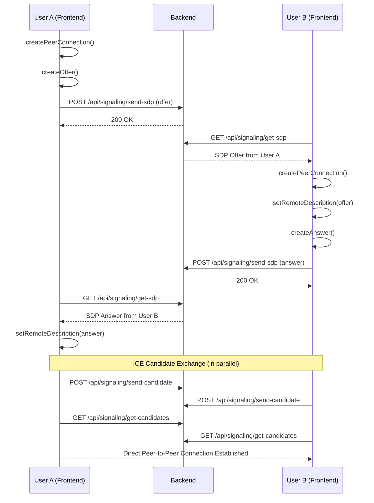

# 📘 WebRTC Calling App (SIP Over WebRTC)

## 🧾 Description
A web-based peer-to-peer calling application that allows users to sign up, log in, see who is online, and initiate real-time video/audio calls using WebRTC. The project also includes a real-time chat feature.

The system follows a microservices architecture, with a standalone frontend and backend that communicate via REST APIs and WebSockets.

## 🏛️ Architecture
The application is split into two main components:
-   **Frontend**: A client-side application built with HTML, CSS, and JavaScript that runs in the browser.
-   **Backend**: A Java-based server that handles user authentication, signaling, presence, and chat message persistence.

### 📞 Call Flow Diagram
Here is the signaling flow for establishing a WebRTC call:


## 🔧 Tech Stack
-   **Frontend**: HTML, CSS, JavaScript (WebRTC)
-   **Backend**: Java (Servlets), WebSocket
-   **Database**: MySQL
-   **Communication**: REST API, WebSockets
-   **Build Tool**: Apache Maven
-   **Server**: Apache Tomcat or any Servlet container

## 🎯 Features
-   **User Authentication**: Secure sign-up and login.
-   **User Presence**: See which users are currently online.
-   **WebRTC Calling**: Real-time audio/video calls with a call rejection flow.
-   **Signaling**: Manages SDP and ICE candidate exchange.
-   **Real-time Chat**: Send and receive text messages instantly.
-   **Message History**: Stores and retrieves chat history.

## 🚀 Setup and Installation

### 1. Backend Setup
1.  **Database Setup**:
    -   Ensure you have a MySQL server running.
    -   Execute the `backend/src/main/resources/sql/database_setup.sql` script to create the database and tables.
    -   `mysql -u your_username -p < backend/src/main/resources/sql/database_setup.sql`

2.  **Configure Database Connection**:
    -   Open `backend/src/main/java/com/webrtc/backend/util/DatabaseUtil.java`.
    -   Update the `USER` and `PASSWORD` constants with your MySQL credentials.

3.  **Build the Project**:
    -   Navigate to the `backend` directory.
    -   Use Maven to build the project:
        ```bash
        cd backend
        mvn clean install
        ```

4.  **Deploy**:
    -   Deploy the generated `WebRTC_BackEnd.war` file (from `backend/target/`) to a Servlet container like Apache Tomcat.

### 2. Frontend Setup
1.  **Configuration**:
    -   Open the JavaScript files in the `Frontend/js` directory.
    -   Update the API endpoint URLs to match your backend server's address (e.g., `http://localhost:8080/WebRTC_BackEnd`).
2.  **Run**:
    -   Serve the `Frontend` directory using a simple web server or by deploying it to your application server.

## 🔗 API Documentation
*(Note: Replace `localhost:8080` and `/WebRTC_BackEnd` with your server's address and application context path.)*

<details>
<summary><strong>Authentication API</strong></summary>

#### **Register New User**
- `POST /api/auth/signup`
- **Body**: `{"username": "newuser", "password": "password123", "msisdn": "1234567890"}`

#### **Login User**
- `POST /api/auth/login`
- **Body**: `{"username": "newuser", "password": "password123"}`

#### **Logout User**
- `POST /api/auth/logout`
- **Body**: `{"userId": 1}`

</details>

<details>
<summary><strong>User & Presence API</strong></summary>

#### **List Online Users**
- `GET /api/users/online`

#### **Send a User Heartbeat**
- `POST /api/users/heartbeat`
- **Body**: `{"userId": 1}`

</details>

<details>
<summary><strong>WebRTC Signaling API</strong></summary>

#### **Send SDP (Offer/Answer)**
- `POST /api/signaling/send-sdp`
- **Body**: `{"senderId": 1, "receiverId": 2, "type": "offer", "sdp": "..."}`

#### **Poll for Incoming SDP**
- `GET /api/signaling/get-sdp?receiverId=2`

#### **Send ICE Candidate**
- `POST /api/signaling/send-candidate`
- **Body**: `{"senderId": 1, "receiverId": 2, "candidate": "..."}`

#### **Poll for Incoming ICE Candidates**
- `GET /api/signaling/get-candidates?receiverId=2`

#### **Reject a Call**
- `POST /api/signaling/reject-call`
- **Body**: `{"from": "2", "to": "1"}`

#### **Poll for Call Status**
- `GET /api/signaling/call-status?from=1&to=2`

</details>

<details>
<summary><strong>Chat API</strong></summary>

#### **WebSocket Endpoint**
- `/ws/chat/{userId}`
- **Connect**: `ws://your-server/WebRTC_BackEnd/ws/chat/{userId}`
- **Send Message**: `{"receiverId": 2, "content": "Hello!"}`

#### **Get Chat History**
- `GET /api/chat/messages?userId1=1&userId2=2`

#### **Get Unread Messages**
- `GET /api/chat/unread?userId=1`

</details>
